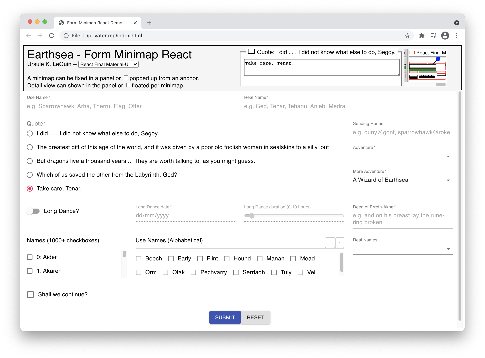

# Form Minimap
This library displays a minimap for an HTML form.
It shows the location, value, and status message for each element in the form.
It also tries to compute the overall form status based on the constituent element statuses.



The minimap is especially useful for long forms which may not fit in the viewport and require scrolling to see the whole form itself.
Most pages would have only one minimap for the form, but multiple minimaps may be useful in a wizard, for example, one for each step of the wizard.
This would allow users to see the values entered in previous steps.
The ability to see off-screen form element values can be useful for context, as well as cutting and pasting.

The minimap can be set permanently visible in a panel DIV or popped up on mouse enter in a per-minimap DIV.
The details for each form element can be shown in a permanently visible shared DIV or in a popup per minimap.

When a form is destroyed, its corresponding minimap should be detached or destroyed.
The [Angular](https://github.com/sparrowhawk-ea/fmm-ng), [React](https://github.com/sparrowhawk-ea/fmm-react), and [Vue](https://github.com/sparrowhawk-ea/fmm-vue) components supplied with this library will detach the minimap when the component is destroyed.  This will happen when the component tag is placed inside the form.

Please feel free to play around with the [Angular](https://github.com/sparrowhawk-ea/fmm-ng-demo), [React](https://github.com/sparrowhawk-ea/fmm-react-demo), and [Vue](https://github.com/sparrowhawk-ea/fmm-vue-demo) demos.  Feedback is always welcome.

Limitations:
- Only form elements with an ID or NAME attribute, which are not HIDDEN, are monitored.
- Only bootstrap4, material-ui, and angular material handlers are supplied with the library, although it should be easy enough to use these as a starting point to write your own handler for other layout frameworks.
- Complicated forms may not be supported, although css display changes are handled to some extent.
- No automated testing yet.
- No WCAG accessibility yet.  It might even be better to hide the minimap and panel from screen readers since they duplicate information already in the form.

If you find this software useful, please feel free to <a href="https://www.buymeacoffee.com/sparrowhawkea"></a>

Thank you.

***
# Getting Started
## Installation
```bash
npm install --save @eafmm/core
```

## Usage
1. Create a [panel](#fmmpanel).  Most pages will contain only one panel.
1. Create a [minimap](#fmmminimap) using the panel.  Most pages (except SPA wizards) will contain only one minimap per panel.
1. Detach or destroy the minimap when its corresponding form is destroyed.
1. In SPA wizards, you may create a minimap for each step of the wizard.
1. Destroy the panel when no more minimaps are needed.  Any detached minimaps in this panel will be destroyed.

## Example
```ts
import { Fmm, FmmMinimap, FmmPanel } from '@eafmm/core';

const panel = Fmm.createPanel(undefined, parentDiv, detailParentDiv);
const p: FmmMinimapCreateParam = {
   form: myForm,
   title: 'Important Info',
   usePanelDetail: true
};
const minimap = panel.createMinimap(p);

...

minimap.detach();
panel.destructor();
```

***
# API
## Fmm

Static Method | Parameter/Returns | Description
--- | --- | ---
createPanel | ( | Create a panel.
&nbsp; | ef: [FmmElementFactory](#fmmelementfactory) | Advanced usage.  Can be undefined for most cases.
&nbsp; | parent: HTMLElement | Parent for the panel.
&nbsp; | <a name='pcp-detailparent'></a>detailParent?: HTMLElement | Parent for the detail area.  If undefined, details will be shown in a popup.
&nbsp; | <a name='pcp-vertical'></a>vertical?: boolean | Stack minimaps vertically in the panel.
&nbsp; | ): [FmmPanel](#fmmpanel)

## FmmElementFactory

## FmmFramework

## FmmMapString

## FmmMinimap

Method | Parameter/Returns | Description
--- | --- | ---
compose | ( | Sync the minimap with changes in form composition if elements were added or removed.
&nbsp; | <a name='mm-compose-customwidgetids'></a>customWidgetIds?: string[] | List of non-standard form elements by ID or NAME attribute.
&nbsp; | ): void
<a name='mm-destructor'></a>destructor | (): void | Destroy this minimap and remove it from the DOM.
detach | (): void | Detach this minimap.  Detached minimaps will be shown grayed out.
<a name='mm-takesnapshot'></a>takeSnapshot | (): boolean | Sync the minimap with the values and statuses of form elements.  Returns false if minimap was detached or destroyed.

## FmmMinimapCreateParam

Property | Type | Default | Description
--- | --- | --- | ---
<a name='mcp-aggregatelabels'></a>aggregateLabels | [FmmMapString](#fmmmapstring) | |
<a name='mcp-anchor'></a>anchor | HTMLElement | | The element whose mouse enter event will show the minimap as a popup.  If undefined, the minimap will be shown in the panel.
<a name='mcp-deboucemsec'></a>debounceMsec | number | 200 | Delay for responding to form changes.
<a name='mcp-dynamiclabels'></a>dynamicLabels | string[] | | List of form elements, by ID or NAME, whose label may change after creation.
<a name='mcp-form'></a>form | HTMLFormElement | **Required** | The form.
<a name='mcp-framework'></a>framework | [FmmFramework](#fmmframework) | | 
<a name='mcp-onupdate'></a>onUpdate | [FmmOnUpdate](#fmmonupdate) | | Callback when the minimap updates itself for whatever reason.
<a name='mcp-page'></a>page | HTMLElement | | Alternative element to use instead of the form to determine the bounding rectangle containing all form elements.
<a name='mcp-store'></a>store | [FmmStore](#fmmstore)
<a name='mcp-title'></a>title | string | **Required** | Minimap title.
<a name='mcp-usepaneldetail'></a>usePanelDetail | boolean | false | Show details in panel instead of creating a popup per minimap.
<a name='mcp-usewidthtoscale'></a>useWidthToScale | boolean | false | Use width rather than height to size the minimap, maintaining aspect ratio of the form (or **page** if specified).
<a name='mcp-verbosity'></a>verbosity | number | 0 | Set to 1 to see processing times in console.
<a name='mcp-widgetfactories'></a>widgetFactories | [FmmWidgetFactory](#fmmwidgetfactory)[] | | 

## FmmOnUpdate

## FmmPanel

Method | Parameter/Returns | Description
--- | --- | ---
createMinimap | ( | Create a mininap in this panel.
&nbsp; | p: [FmmMinimapCreateParam](#fmmminimapcreateparam)
&nbsp; | ): [FmmMinimap](#fmmminimap)
<a name='pm-destroydetached'></a>destroyDetached | (): void | Destroy all detached minimaps in this panel.
destructor | (): void | Destroy this panel and remove it from the DOM.

## FmmStore
Constructs a store as a single source of truth (SSOT) for form values and errors.  Without a store, the form elements will be monitored directly.

## FmmWidgetFactory
