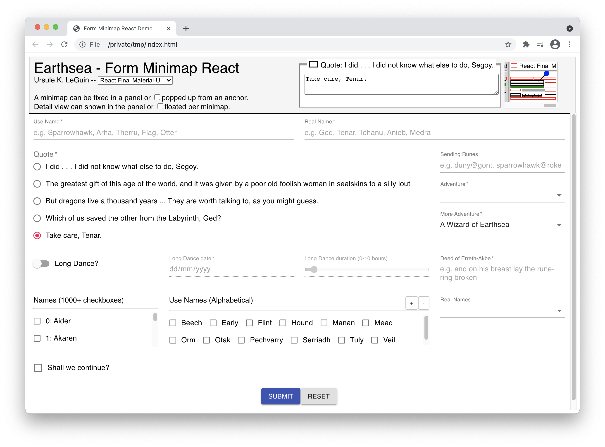

# Form Minimap
This library displays a minimap for an HTML form.
It shows the location, value, and status message for each field in the form.
It also tries to compute the overall form status based on the constituent field statuses.

The minimap is especially useful for long forms which may not fit in the viewport and require scrolling to see the whole form itself.
Most pages would have only one minimap for the form, but multiple minimaps may be useful in a wizard, for example, where previous step minimaps can be left visible (but detached) so the user can see the values entered in those steps.
The ability to see off-screen form fields and their values can be useful for context, as well as cutting and pasting.

The minimap can be set permanently visible in a panel DIV or popped up on mouse enter in a per-minimap DIV.
The details for each field can be shown in a permanently visible shared DIV or in a popup per minimap.

When a form is destroyed, its corresponding minimap should be detached or destroyed.
The [Angular](https://github.com/sparrowhawk-ea/fmmp-ng), [React](https://github.com/sparrowhawk-ea/fmmp-react), and [Vue](https://github.com/sparrowhawk-ea/fmmp-vue) components will detach the minimap when the component is destroyed.  This will happen when the component tag is placed within the form.

Please feel free to play around with the [Angular](https://github.com/sparrowhawk-ea/fmmp-ng-demo), [React](https://github.com/sparrowhawk-ea/fmmp-react-demo), and [Vue](https://github.com/sparrowhawk-ea/fmmp-vue-demo) demos.  Feedback is always welcome, but no pull requests (sorry).

Limitations:
- Only form input fields with an ID or NAME attribute, which are not HIDDEN, are monitored.
- Only bootstrap4, material-ui, and angular material handlers are supplied with the library, although it should be easy enough to use these as a starting point to write your own handler for other layout frameworks.
- Complicated forms may not be supported, although css display changes are handled to some extent.
- No automated testing yet.
- No WCAG accessibility yet.  It might even be better to hide the panel and minimap from screen readers since they duplicate information already in the form.

If you find this software useful, please feel free to 

Thank you.

***
Please visit the project's Github page for more information.
